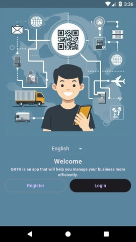
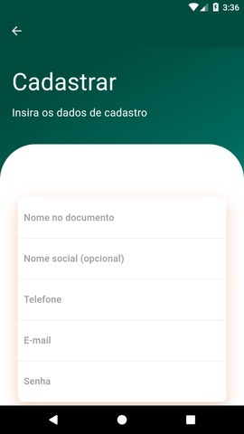
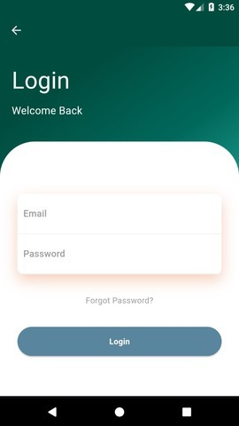
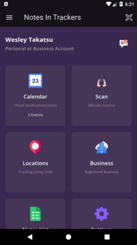
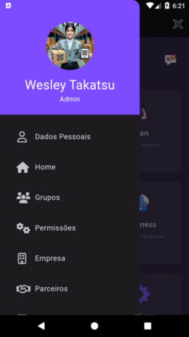
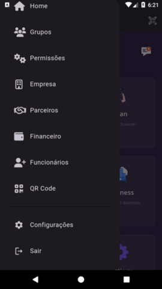

*[Conheça meu Linkedin!](https://www.linkedin.com/in/wesleytakatsu/)*  
*[Discover my Linkedin!](https://www.linkedin.com/in/wesleytakatsu/)*


# Notes In Trackers App

Notes In Trackers App é uma aplicação desenvolvida em Flutter com backend em Laravel 11. O objetivo deste aplicativo é utilizar QRCode para rastrear a localização de qualquer objeto vinculado ao código QR.

## Sobre o Projeto

O Notes In Trackers App foi criado para solucionar problemas comuns de rastreamento e localização de objetos em diversos ambientes, como escritórios, armazéns e até mesmo em residências. Ao vincular um código QR a um objeto, o aplicativo permite que os usuários utilizem seus smartphones para escanear o código e registrar a localização do objeto em tempo real. 

### Benefícios para Empresas

- **Aumento da Eficiência**: Reduz o tempo gasto procurando por objetos, permitindo que os funcionários localizem rapidamente itens importantes.
- **Rastreamento Preciso**: Fornece uma localização precisa dos objetos, minimizando perdas e melhorando o gerenciamento de inventário.
- **Histórico de Localizações**: Mantém um registro detalhado de onde os objetos foram localizados, facilitando auditorias e controle de movimentação.
- **Integração Simples**: Pode ser facilmente integrado com sistemas de gestão existentes, como ERPs e CRMs, para uma gestão de recursos mais coesa.
- **Economia de Custos**: Reduz os custos associados a objetos perdidos ou extraviados, aumentando a transparência e responsabilidade dentro da empresa.
- **Notificações em Tempo Real**: Receba alertas instantâneos sobre a movimentação de objetos críticos, permitindo respostas rápidas em caso de necessidade.
- **Qualquer lugar do mundo**: Use o mesmo sistema com pessoas de todo o mundo com o suporte as linguagens inglês, português e espanhol.

O Notes In Trackers App é uma ferramenta poderosa para qualquer empresa que precise de um sistema confiável e eficiente para rastreamento de objetos, oferecendo benefícios claros em termos de eficiência operacional e redução de custos.

## Funcionalidades

- **Leitura de QRCode**: Utilize a câmera do seu celular para ler códigos QR.
- **Rastreamento de Localização**: Rastreie a localização do objeto vinculado ao QRCode.
- **Histórico de Localizações**: Visualize o histórico de localizações onde o objeto foi rastreado.
- **Notificações**: Receba notificações sobre a localização dos objetos rastreados.
- **Anotações**: Crie notas com informações, quantidade e muitos outros dados ao objeto vinculado ao QRCode.

## Imagens da aplicação










## Tecnologias Utilizadas

- **Frontend**: Flutter
- **Backend**: Laravel 11
- **Banco de Dados**: PostgreSQL
- **Autenticação**: Laravel Sanctum
- **API**: RESTful API

## Instalação

### Pré-requisitos

- Flutter SDK
- Dart
- PHP 8
- Composer
- Docker
- Docker-compose

### Passos para Instalar

1. Clone este repositório:
    ```bash
    git clone https://github.com/wesleytakatsu/qrtk_app.git
    ```

2. Navegue até o diretório do frontend:
    ```bash
    cd qrtk_app/
    ```

3. Instale as dependências do Flutter:
    ```bash
    flutter pub get
    ```

4. Teste o App:
    ```bash
    flutter run
    ```


## Licença

Este projeto está licenciado sob a licença MIT. Veja o arquivo [LICENSE](LICENSE) para mais detalhes.

---

Feito com ❤️ por Wesley Sieiro Takatsu de Araujo
